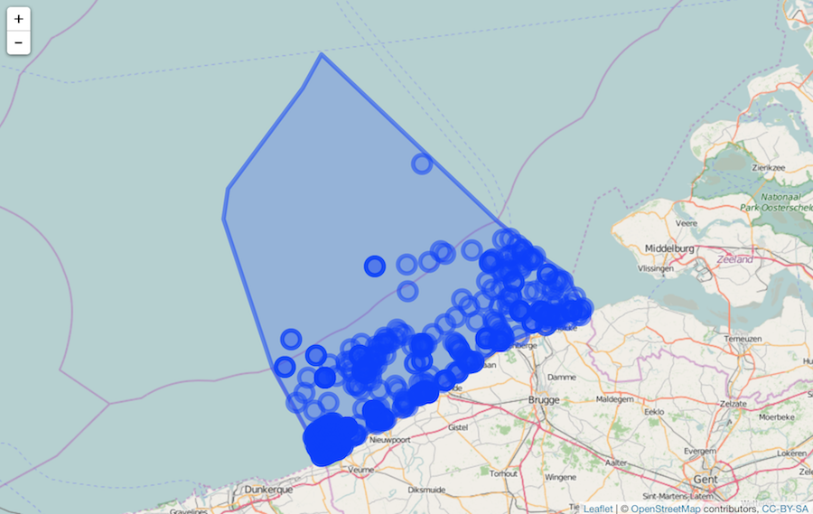
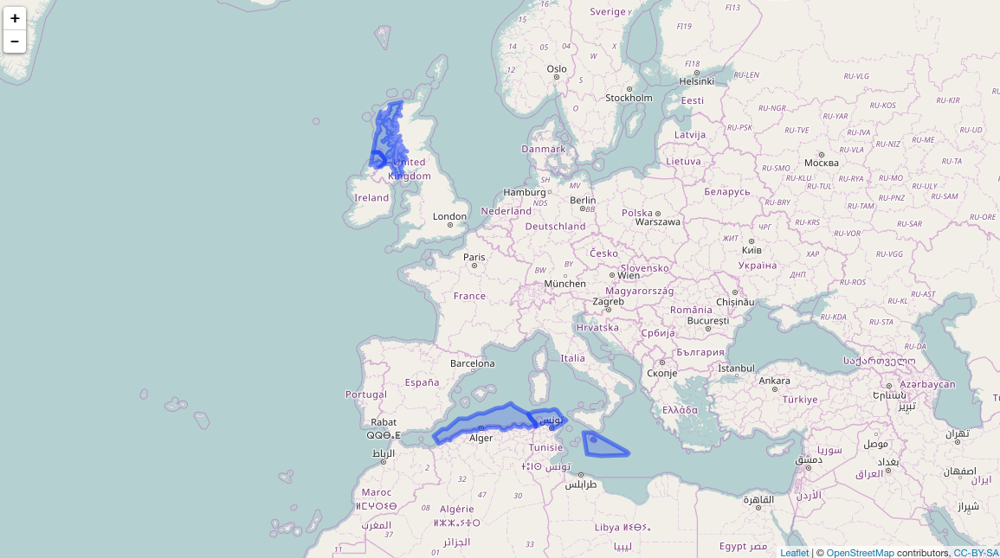
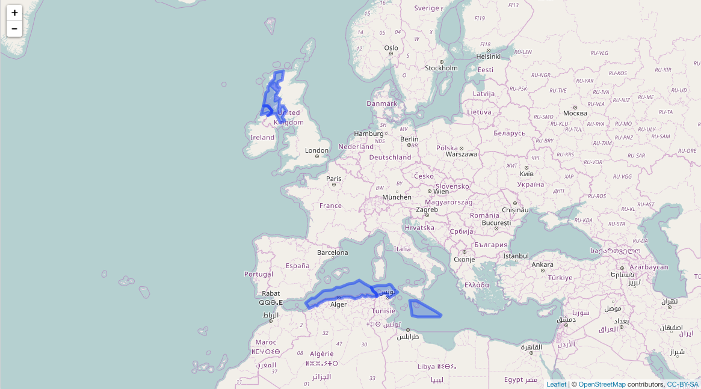

<!--
%\VignetteEngine{knitr::knitr}
%\VignetteIndexEntry{mregions introduction}
%\VignetteEncoding{UTF-8}
-->


mregions introduction
=====================

A few notes before we begin:

* `mregions` will be on CRAN soon, install from github for now
* master version of `robis` lives at `iobis/robis`, but i use a slight changed in my fork :)

## Install

Stable version (not on CRAN yet, soon though)


```r
install.packages("mregions")
```

Dev version


```r
devtools::install_github(c("sckott/mregions", "sckott/robis"))
install.packages("leaflet")
```


```r
library("mregions")
```

## Get list of place types


```r
res <- place_types()
head(res$type)
#> [1] "Town"                      "Arrondissement"           
#> [3] "Department"                "Province (administrative)"
#> [5] "Country"                   "Continent"
```

## Get Marineregions records by place type


```r
res <- records_by_type(type = "EEZ")
head(res)
#>   MRGID                                            gazetteerSource
#> 1  3293 Maritime Boundaries Geodatabase, Flanders Marine Institute
#> 2  5668 Maritime Boundaries Geodatabase, Flanders Marine Institute
#> 3  5669 Maritime Boundaries Geodatabase, Flanders Marine Institute
#> 4  5670 Maritime Boundaries Geodatabase, Flanders Marine Institute
#> 5  5672 Maritime Boundaries Geodatabase, Flanders Marine Institute
#> 6  5673 Maritime Boundaries Geodatabase, Flanders Marine Institute
#>   placeType latitude longitude minLatitude minLongitude maxLatitude
#> 1       EEZ 51.46483  2.704458    51.09111     2.238118    51.87000
#> 2       EEZ 53.61508  4.190675    51.26203     2.539443    55.76500
#> 3       EEZ 54.55970  8.389231    53.24281     3.349999    55.91928
#> 4       EEZ 40.87030 19.147094    39.63863    18.461940    41.86124
#> 5       EEZ 42.94272 29.219062    41.97820    27.449580    43.74779
#> 6       EEZ 43.42847 15.650844    41.62201    13.001390    45.59079
#>   maxLongitude precision            preferredGazetteerName
#> 1     3.364907  58302.49   Belgian Exclusive Economic Zone
#> 2     7.208364 294046.10     Dutch Exclusive Economic Zone
#> 3    14.750000 395845.50    German Exclusive Economic Zone
#> 4    20.010030 139751.70  Albanian Exclusive Economic Zone
#> 5    31.345280 186792.50 Bulgarian Exclusive Economic Zone
#> 6    18.552360 313990.30  Croatian Exclusive Economic Zone
#>   preferredGazetteerNameLang   status accepted
#> 1                    English standard     3293
#> 2                    English standard     5668
#> 3                    English standard     5669
#> 4                    English standard     5670
#> 5                    English standard     5672
#> 6                    English standard     5673
```

## Get and search region names


```r
res <- region_names()
region_names_search(query = "IHO")
#> [[1]]
#> [[1]]$name
#> [1] "MarineRegions:iho"
#> 
#> [[1]]$title
#> [1] "IHO Sea Areas"
#> 
#> [[1]]$name_first
#> [1] "MarineRegions"
#> 
#> [[1]]$name_second
#> [1] "iho"
#> 
#> 
#> [[2]]
#> [[2]]$name
#> [1] "MarineRegions:iho_quadrants_20150810"
#> 
#> [[2]]$title
#> [1] "IHO quadrants (20150810)"
#> 
#> [[2]]$name_first
#> [1] "MarineRegions"
#> 
#> [[2]]$name_second
#> [1] "iho_quadrants_20150810"
#> 
#> 
#> [[3]]
#> [[3]]$name
#> [1] "World:iosregions"
#> 
#> [[3]]$title
#> [1] "IOS Regions"
#> 
#> [[3]]$name_first
#> [1] "World"
#> 
#> [[3]]$name_second
#> [1] "iosregions"
#> 
#> 
#> [[4]]
#> [[4]]$name
#> [1] "MarineRegions:eez_iho_union_v2"
#> 
#> [[4]]$title
#> [1] "Marineregions: the intersect of the Exclusive Economic Zones and IHO areas"
#> 
#> [[4]]$name_first
#> [1] "MarineRegions"
#> 
#> [[4]]$name_second
#> [1] "eez"
#> 
#> 
#> [[5]]
#> [[5]]$name
#> [1] "Belgium:vl_venivon"
#> 
#> [[5]]$title
#> [1] "VEN (Flanders Ecological Network) and IVON (Integral Interrelated and Supporting Network)  areas in Flanders"
#> 
#> [[5]]$name_first
#> [1] "Belgium"
#> 
#> [[5]]$name_second
#> [1] "vl_venivon"
```

## Get a region - geojson


```r
res <- region_geojson(name = "Turkmen Exclusive Economic Zone")
class(res)
#> [1] "mr_geojson"
names(res)
#> [1] "type"          "totalFeatures" "features"      "crs"          
#> [5] "bbox"
```

## Get a region - shp


```r
res <- region_shp(name = "Belgian Exclusive Economic Zone")
class(res)
#> [1] "SpatialPolygonsDataFrame"
#> attr(,"package")
#> [1] "sp"
```

## Get OBIS EEZ ID


```r
res <- region_names()
res <- Filter(function(x) grepl("eez", x$name, ignore.case = TRUE), res)
obis_eez_id(res[[2]]$title)
#> [1] 84
```

## Convert to WKT

From geojson or shp. Here, geojson


```r
res <- region_geojson(key = "MarineRegions:eez_33176")
as_wkt(res, fmt = 5)
#> [1] "MULTIPOLYGON (((41.573732 -1.659444, 45.891882 ... cutoff
```

## Get regions, then OBIS data

### Using Well-Known Text

Both shp and geojson data returned from `region_shp()` and `region_geojson()`, respectively, can be passed to `as_wkt()` to get WKT.


```r
library('robis')
shp <- region_shp(name = "Belgian Exclusive Economic Zone")
wkt <- as_wkt(shp)
xx <- occurrence("Abra alba", geometry = wkt)
#> 
Retrieved 695 records of 695 (100%)
xx <- xx[, c('scientificName', 'decimalLongitude', 'decimalLatitude')]
names(xx) <- c('scientificName', 'longitude', 'latitude')
```

Plot


```r
library('leaflet')
leaflet() %>%
  addTiles() %>%
  addCircleMarkers(data = xx) %>%
  addPolygons(data = shp)
```



### Using EEZ ID

EEZ is a Exclusive Economic Zone


```r
library('robis')
(eez <- obis_eez_id("Belgian Exclusive Economic Zone"))
#> [1] 59
```

You currently can't search for OBIS occurrences by EEZ ID, but hopefully soon...

## Dealing with bigger WKT

What if you're WKT string is super long?  It's often a problem because some online species occurrence databases that accept WKT to search by geometry bork due to
limitations on length of URLs if your WKT string is too long (about 8000 characters,
including remainder of URL). One way to deal with it is to reduce detail - simplify.


```r
devtools::install_github("ateucher/rmapshaper")
```

Using `rmapshaper` we can simplify a spatial object, then search with that.


```r
shp <- region_shp(name = "Dutch Exclusive Economic Zone")
```

Visualize


```r
leaflet() %>%
  addTiles() %>%
  addPolygons(data = shp)
```



Simplify


```r
library("rmapshaper")
shp <- ms_simplify(shp)
```

It's simplified:


```r
leaflet() %>%
  addTiles() %>%
  addPolygons(data = shp)
```



Convert to WKT


```r
wkt <- as_wkt(shp)
```

### OBIS data

Search OBIS


```r
library("robis")
dat <- occurrence_single(geometry = wkt, limit = 500, fields = c("species", "decimalLongitude", "decimalLatitude"))
head(dat)
#>               species decimalLongitude decimalLatitude
#> 1  Temora longicornis         3.423300        55.39170
#> 2  Temora longicornis         3.518300        55.39170
#> 3 Stragularia clavata         4.190675        53.61508
#> 4                <NA>         4.189400        53.55727
#> 5   Stylonema alsidii         4.190675        53.61508
#> 6                <NA>         4.318000        53.30720
```

[mr]: https://github.com/ropenscilabs/mregions
